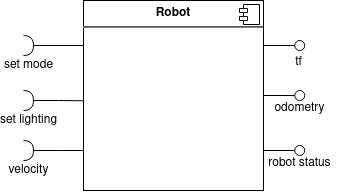
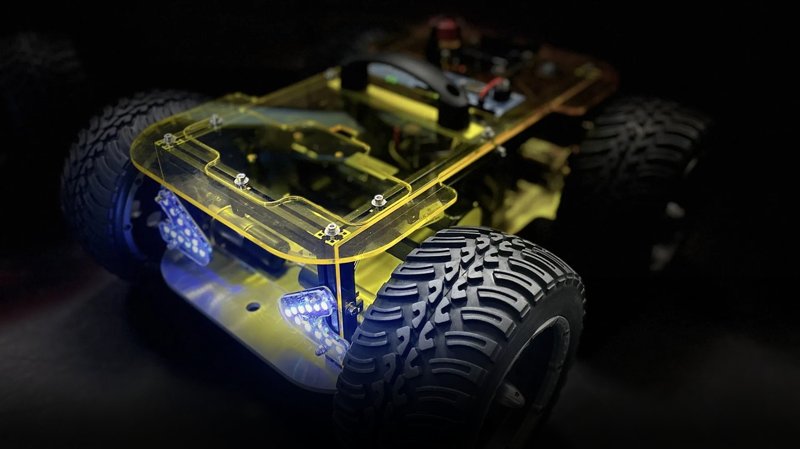
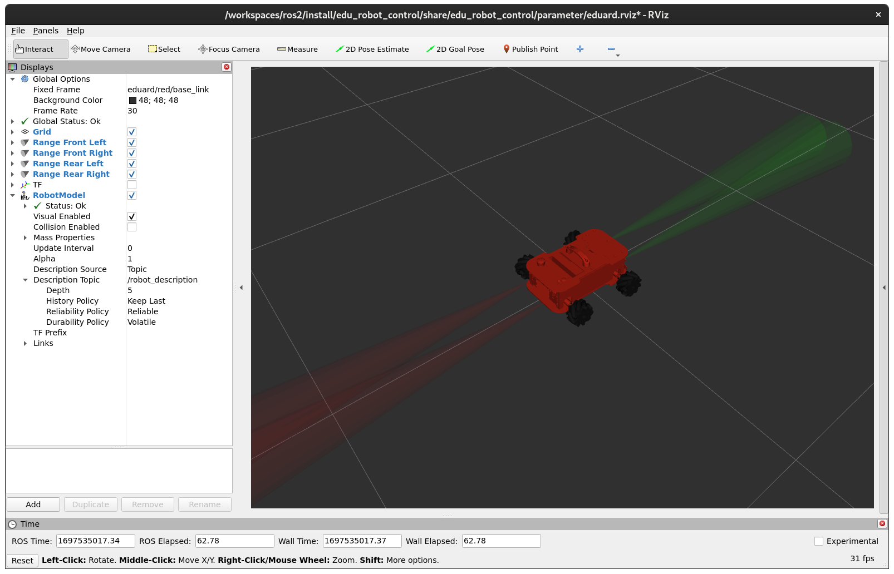
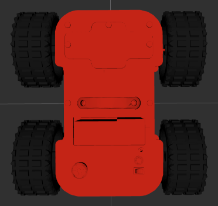
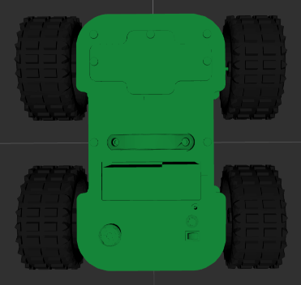
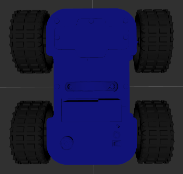
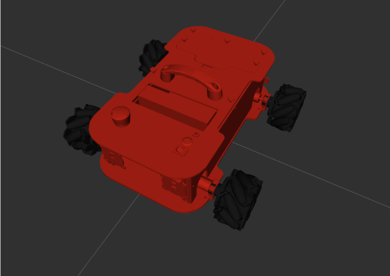
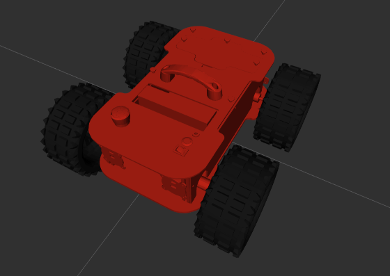
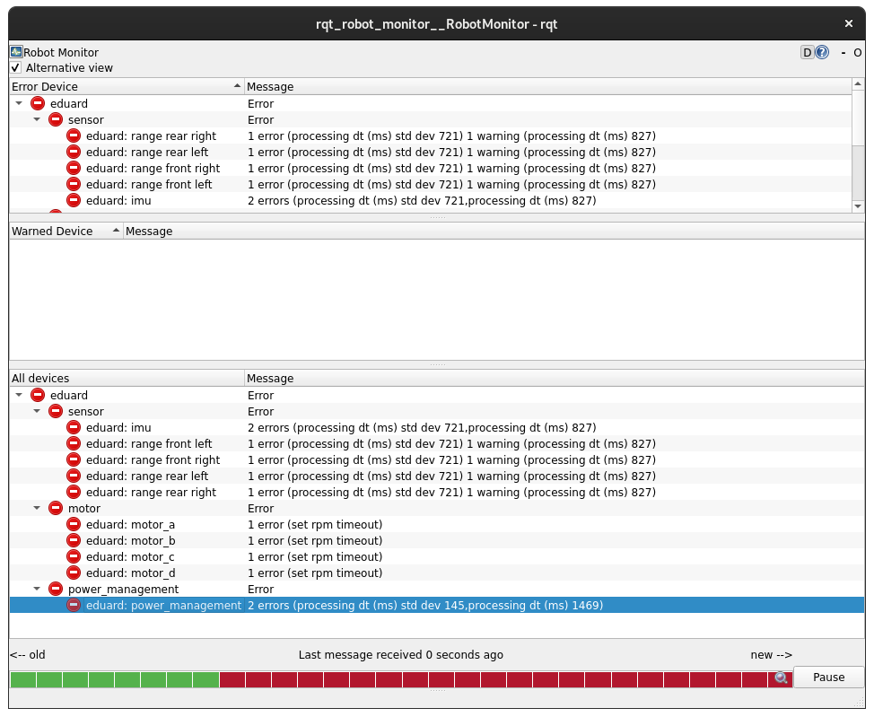
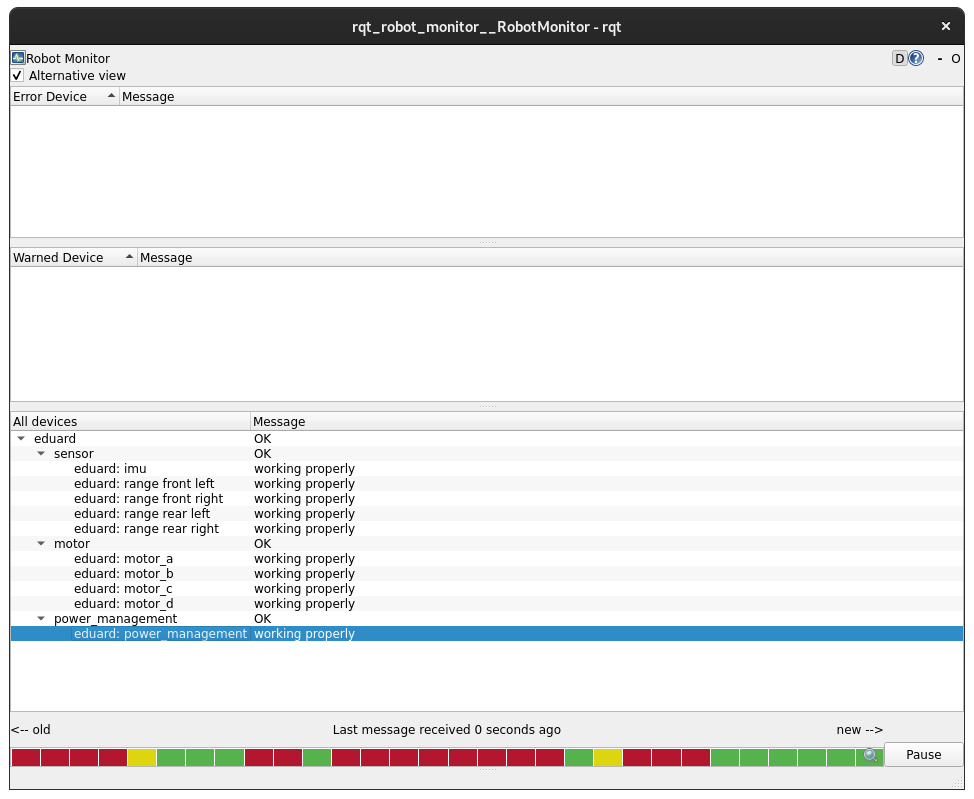

# edu_robot

Welcome to the EduArt ROS2 robot control software. In first place it provides a ROS2 node for controlling and monitoring EduArt robots, i.e., the robot Eduard in different hardware realizations like the IoT Bot, the IPC Bot or a custom build robot relying on our stackable drive system. There is also a [digital twin](https://github.com/EduArt-Robotik/edu_simulation) in the making, which is not yet feature complete. But, some basic interfaces are already implemented.

These packages are also designed for being used in a robot fleet setup. Basically, they are able to handle multiple robot instances at the same time while using namespaces.

> **_NOTE:_** For further help please visit our [Forum](https://forum.eduart-robotik.com) or drop a message to info@eduart-robotik.com.


# EduArt's Robot ROS Interfaces

These basic interfaces are valid for all our robots. Following inputs are required for an operating robot:




## Topics

| Description                     | Topic                    | Type  | Message Type |
|---------------------------------|--------------------------|-----------|---------------------------|
| Velocity Input                  | /eduard/cmd_vel            | Input | sensor_msgs/msg/Twist                |
| Set Lighting Color/Mode         | /eduard/set_lighting_color | Input | edu_robot/msg/SetLightingColor       |
| TF | /tf | In-/Output | |
| Measured Odometry | /eduard/odom | Output | nav_msgs/Odometry |
| Robot Status Report            | /eduard/status_report | Output | edu_robot/msg/RobotStatusReport      |
| Join States of the Wheels       | /joint_states | Output            | sensor_msgs/msg/JointState           |

Note: "/eduard" in topic name is the default namespace if no other was defined. This namespace can be freely defined by the "namespace" ROS parameter. Please take into account that the topic name changes according to the namespace.

## Services

| Description                     | Service                  | Message type                         |
|---------------------------------|--------------------------|--------------------------------------|
| Set Mode Service (used for Enable robot) | /eduard/set_mode       | edu_robot/srv/SetMode                |

Note: "/eduard" in service name is the default namespace if no other was defined. This namespace can be freely defined. Please take into account that the service name changes according to the namespace, too.

## Different Operation Modes

The minium input the robots require are the velocity command and the service "set_mode". Without an velocity command, the robot will detect an timeout and switch of the motor controller. This leads in an "inactive" robot (disabled). If the velocity input is send the robot can be activated for remote control drive by calling the service "set_mode". Below all current implemented modes are listed:

| Mode | Description |
|------|-------------|
| INACTIVE | The robot is inactive. All drives are disabled. The velocity commands have no effect. |
| REMOTE_CONTROLLED | The robot is active. All drives are enabled. The robot processes the velocity commands. |
| AUTONOMOUS | The robot is active. The mecanum drive kinematic is used. The robot will subscribe to the topic "autonomous/cmd_vel". |
| SKID_DRIVE | Uses the kinematic of an skid drive. Note: only available if the robot supports it. |
| MECANUM_DRIVE | Uses the kinematic of an mecanum drive. Note: only available if the robot supports it. |
| COLLISION_AVOIDANCE_OVERRIDE_ENABLED | If the robots accepts it the integrated collision avoidance will be overridden. |
| COLLISION_AVOIDANCE_OVERRIDE_DISABLED | If the robot accepts it the integrated collision avoidance will be activated when it is enabled in general. |

These modes are combinable, but they must be requested separately by the "set_mode" service. In the response of this service a list of the robot's complete mode is sent.

Note: a ready to use package is available for controlling the robot by an Gamepad or Joystick. Please see section "Controlling the Robot" or visit the repository [edu_robot_control](https://github.com/EduArt-Robotik/edu_robot_control).

# EudArt's Robot Eduard ROS Interface



Eduard is our main robot system. It consists from of four wheels, four lightings including range sensors. And of an integrated IMU sensor. The robot realizes the above defined interfaces and expand it by the following ones:

| Description                     | Topic                    | Message type                         |
|---------------------------------|--------------------------|--------------------------------------|
| Range Sensor Output Front Left  | /range/front/left/range  | sensor_msgs/msg/Range                |
| Range Sensor Output Front Right | /range/front/right/range | sensor_msgs/msg/Range                |
| Range Sensor Output Rear Left   | /range/rear/left/range   | sensor_msgs/msg/Range                |
| Range Sensor Output Rear Right  | /range/rear/right/range  | sensor_msgs/msg/Range                |


# Lighting Codes

| Mode | Color | Description |
|------|-------|-------------|
|UNCONFIGURED| white (pulsation) | During boot up. |
|INACTIVE| white (dim) | Motors are disabled, no error state present. First state after reboot. |
|REMOTE_CONTROLLED| white (dim) | Motors are enabled, robot is ready for driving remote controlled. |
|AUTONOMOUS| white (flashing) | Robot is in fleet mode and enabled. |
|CHARGING| green (pulsation) | |


# Deploying

A Docker container is used to run this software on our robots. Normally, all our robots are shipped with a Docker container registered to start after a reboot. If you want to deploy a newer version, or whatever the reason, make sure to remove the previously deployed container. To check which containers are running, use the following command:

```bash
docker container ls 
```
A typically print out looks like:

```bash
CONTAINER ID   IMAGE                      COMMAND                  CREATED      STATUS          PORTS     NAMES
46c8590424c0   eduard-iotbot:0.2.1-beta   "/ros_entrypoint.sh …"   6 days ago   Up 21 minutes             eduard-iotbot-0.2.1-beta
```

To stop and remove the container, use the following command with the container ID displayed by the above command:

```bash
docker stop <container id>
docker rm <container id>
```

## Deploying on IoT2050

### Use Prebuilt Docker Images

The easiest way, and one that is usually quite sufficient, is to use a prebuilt Docker image. All released versions of edu_robot software are usually available. 

The following command deploys and starts the image. Note: please make sure that the robot has internet connection. It is considered that the official ["Example Image V1.3.1"](https://support.industry.siemens.com/cs/document/109741799/downloads-f%C3%BCr-simatic-iot20x0?dti=0&lc=de-DE) provided by Siemens will be used for the IoT2050. If this is not the case it cloud lead in a misinterpretation of the game pad.

We provide a docker compose file for the IoT2050. Either [download the file](docker/iot2050/docker-compose.yaml) on IoT2050 or clone the repository and navigate to the file:

```bash
git clone https://github.com/EduArt-Robotik/edu_robot.git
cd edu_robot_control/docker/iot2050
```

Then execute following command inside the folder where the ["docker-compose.yaml"](docker/iot2050/docker-compose.yaml) is located:

```bash
docker compose up
```

Inside the docker compose file a namespace is defined. This namespace can freely be modified. We recommend to reflect the robot color with this namespace. But in general do it like you want.

For removing the docker container execute the command:

```bash
docker compose down
```

at the location of the docker compose file.

## Deploying on IPC127e
### Use Prebuilt Docker Images

The easiest way, and one that is usually quite sufficient, is to use a prebuilt Docker image. All released versions of edu_robot software are usually available. 

We provide a docker compose file for the IPC127e. Either [download the file](docker/ipc127e/docker-compose.yaml) on IPC127e or clone the repository and navigate to the file:

```bash
git clone https://github.com/EduArt-Robotik/edu_robot.git
cd edu_robot_control/docker/ipc127e
```

Then execute following command inside the folder where the ["docker-compose.yaml"](docker/ipc127e/docker-compose.yaml) is located:

```bash
docker compose up
```

Inside the docker compose file a namespace is defined. This namespace can freely be modified. We recommend to reflect the robot color with this namespace. But in general do it like you want.

For removing the docker container execute the command:

```bash
docker compose down
```

at the location of the docker compose file.

# Controlling the Robot

With the package [edu_robot_control](https://github.com/EduArt-Robotik/edu_robot_control) the EduArt's robots can be controlled remotely. Please visit this page for future information. The basic information about how to set up the joystick is also listed below. Note: the package "edu_robot_control" needs to be deployed extra. It is not included in the "edu_robot" deployment.

A controller can be requested to connect by pressing a specific button once. For the recommended controllers, it is the symbol between the axes. To operate the Robot, the following buttons and axes of the controller are assigned as follows:


| Axis  | DS5                       | Idle position | Value range | function          | 
|-------|---------------------------|---------------|-------------|-------------------|
| [0]   | Joystick L: left & right  | 0.0           | 1.0 to -1.0 | Steering
| [1]   | Joystick L: up & down     | 0.0           | 1.0 to -1.0 | not in use
| [2]   | L2                        | 1.0           | 1.0 to -1.0 | not in use
| [3]   | Joystick R: left & right  | 0.0           | 1.0 to -1.0 | not in use
| [4]   | Joystick R: up & down     | 0.0           | 1.0 to -1.0 | Throttle
| [5]   | R2                        | 1.0           | 1.0 to -1.0 | not in use
| [6]   | D-Pad: left & right       | 0.0           | 1.0 to -1.0 | not in use
| [7]   | D-Pad: up & down          | 0.0           | 1.0 to -1.0 | not in use

| Button    | DS5           | Idle position | Value range   | function          | 
|-----------|---------------|---------------|---------------|-------------------|
| [0]       | Square        | 0             | 0 or 1        | Switch to Skid Drive Kinematic
| [1]       | Cross         | 0             | 0 or 1        | Light pattern: Operation
| [2]       | Circle        | 0             | 0 or 1        | Switch to Mecanum Drive Kinematic
| [3]       | Triangle      | 0             | 0 or 1        | Light pattern: Operation
| [4]       | L1            | 0             | 0 or 1        | Light pattern: Turning left
| [5]       | R1            | 0             | 0 or 1        | Light pattern: Turning right
| [6]       | L2            | 0             | 0 or 1        | Enable Fleet Drive
| [7]       | R2            | 0             | 0 or 1        | Override collision avoidance
| [8]       | SHARE         | 0             | 0 or 1        | Disable driving
| [9]       | OPTIONS       | 0             | 0 or 1        | Enable driving
| [10]      | PS            | 0             | 0 or 1        | Connect Controller to Eduard
| [11]      | L3            | 0             | 0 or 1        | not in use
| [12]      | R3            | 0             | 0 or 1        | not in use
| [13]      | Map           | 0             | 0 or 1        | Light pattern: Warning light

# Setting up your Joystick;

A joystick can be used to operate Eduard. For this purpose, the robot must be extended by a Debian-compatible Bluetooth stick. PlayStation&reg; 4 and PlayStation&reg; 5 controllers were used, which are interpreted identically in their operating interface. The initial start-up of a Bluetooth controller follows.

Start the Bluetooth controller in the operating system:

```console
$ bluetoothctl
```

Set up the controller and prepare for scanning:

```console
$ agent on 
$ default-agent 
$ power on 
$ discoverable on 
$ pairable on
```

Put the PlayStation&reg; Controller into connection mode by pressing the Share and PS buttons simultaneously. 
Rapid flashing indicates the status.

<!--  <br> -->

Now start the scanning process:

```console
$ scan on
```

The connection process so far should look like this. Your joystick is now recognised as a wireless controller. Copy the MAC address of the device for the rest of the procedure.

Connect the controller using the following commands and its MAC address. If needed, press the PlayStation button again when the light signals stop flashing.

```console
$ pair XX:XX:XX:XX:XX:XX 
$ trust XX:XX:XX:XX:XX:XX 
$ connect XX:XX:XX:XX:XX:XX
$ exit 
```

NOTE: These steps are only required once at the very beginning. From now on, when the PS button is pressed, the joystick should automatically connect to the IOT2050 once it has successfully booted up. These operations are only then necessary again if the controller has been connected to another device in the meantime.

# Monitoring Eduard using ROS Tools

## RViz2

With the package [edu_robot_control](https://github.com/EduArt-Robotik/edu_robot_control) the EduArt's robots can be monitored using the tool RViz2 coming with ROS2.

For visualization of Eduard's sensors and actors a RViz setup is provided including a robot description. Since Eduard ROS control node publish all of Eduard's states via TF and ROS topic/services it is easy to access them.

The best way to monitor Eduard's states is using RViz. In the package "edu_robot_control" a launch file is provided including a RViz configuration that allows an easy and fast start. Two ways are supported.

### Native ROS2 Installation

If ROS is natively installed the "edu_robot_control" package can be installed into an ROS workspace. As first step clone the package into the workspace by:

```bash
git clone https://github.com/EduArt-Robotik/edu_robot_control.git
```

Please make sure the package will be cloned into the "src" folder in the workspace. If no knowledge about ROS is present please see [docs.ros.org](https://docs.ros.org/en/galactic/Tutorials/Beginner-Client-Libraries/Creating-A-Workspace/Creating-A-Workspace.html) for further information. 

After the package was cloned it needs to be installed via:

```bash
colcon build --packages-select edu_robot_control --symlink-install
```

Now RViz with the correct configuration can be launched by:

```bash
ros2 launch edu_robot_control eduard_monitor.launch.py
```

If RViz comes up properly it will be shown following:



#### Important: Setting Correct Namespace

Each Eduard robot comes with a preset namespace, e.g. to reflect the robot's color. This allows that multiple robots are connected to the same network (with same DOMAIN_ID). However this makes it necessary to deal with the namespace, too, when the robot's data shall be received. For example when displaying data using RViz2.

The namespace can be set by using an environment variable. Either set it via the system or define it in front of the ros command:

```bash
EDU_ROBOT_NAMESPACE=eduard/red ros2 launch edu_robot_control eduard_monitor.launch.py
```

This this case it was set to **eduard/red**. Please replace the color accordingly to your robot. RViz will respect the color and will coloring the robot model. At the moment three colors are available:



#### Select Wheel Type

Eduard comes with two types of wheel. If wanted it can be selected in RViz for a correct visualization by setting a environment variable in front of the ros command:

```bash
EDU_ROBOT_WHEEL_TYPE=offroad ros2 launch edu_robot_control eduard_monitor.launch.py
```

The following two wheel types are available: mecanum and offroad



## rqt robot monitor

The Eduard control software provides a diagnostic aggregation. With this, the status of major components can be displayed, as well as live characteristics of these.

With the standard tool **rqt_robot_monitor** this diagnostic aggregation can be displayed. The application can be started by:

```bash
ros2 run rqt_robot_monitor rqt_robot_monitor
```

Following window will open. Errors and warnings will be shown on the both top lists. By double click on an entry a more detailed windows will open.



 If you want to see the **OK** states, too, then press on the check box **Alternative view** on the top left corner.

 
