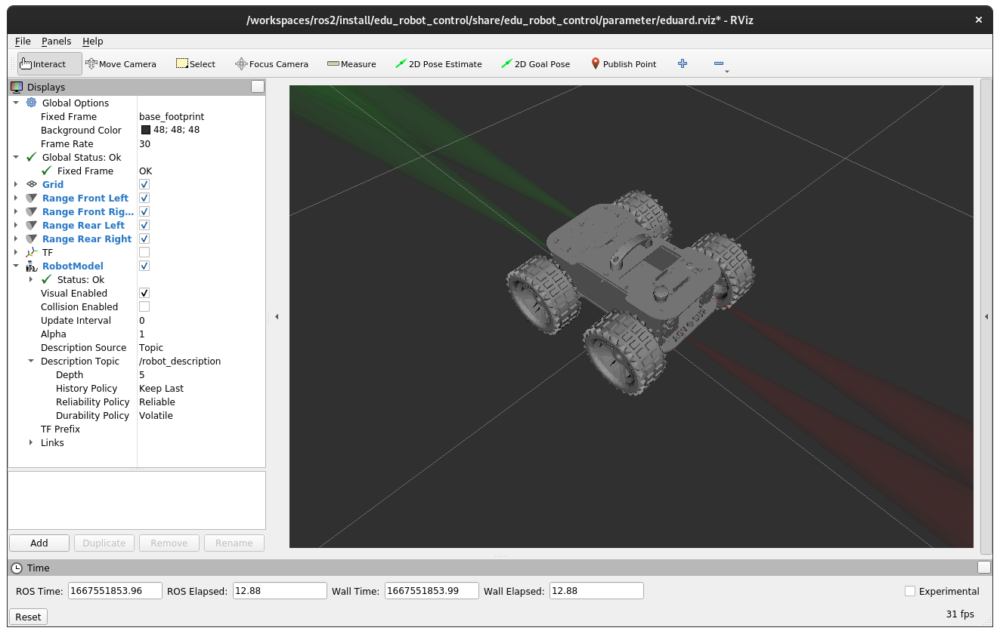

# edu_robot

Welcome to the alpha of EduArt ROS2 robot control software. In first place it provides a ROS2 node for controlling and monitoring the EduArt robots, at the moment Eduard as offroad (skid drive) is supported only. Mecanum kinematic will be supported soon. In future also a ROS2 Gazebo plugin is provided for an easy SIL test environment.

> **_NOTE:_** For further help please visit our [Discord channel](https://discord.gg/tXnjH2cF) or write a e-mail at info@eduart-robotik.com.


# Eduard's ROS Interfaces

Eduard's control node provides following interfaces via ROS topics and services:

| Description                     | Topic                    | Message type                         |
|---------------------------------|--------------------------|--------------------------------------|
| Velocity Input                  | /cmd_vel                 | sensor_msgs/msg/Twist                |
| Set Lighting Color/Mode         | /set_lighting_color      | edu_robot/msg/SetLightingColor       |
| Range Sensor Output Front Left  | /range/front/left/range  | sensor_msgs/msg/Range                |
| Range Sensor Output Front Right | /range/front/right/range | sensor_msgs/msg/Range                |
| Range Sensor Output Rear Left   | /range/rear/left/range   | sensor_msgs/msg/Range                |
| Range Sensor Output Rear Right  | /range/rear/right/range  | sensor_msgs/msg/Range                |
| Odometry Output of Fused Ego Sensors (DO NOT WORK AT THE MOMENT!) | /odometry | nav_msgs/msg/Odometry |
| Status Report Output            | /status_report           | edu_robot/msg/RobotStatusReport      |
| TF Transforms from Sensors      | /tf                      | tf2_msgs/msg/TFMessage               |
| Join States of the Wheels       | /joint_states            | sensor_msgs/msg/JointState           |


| Description                     | Service                  | Message type                         |
|---------------------------------|--------------------------|--------------------------------------|
| Set Mode Service (used for Enable robot) | /set_mode       | edu_robot/srv/SetMode                |


# Controlling the Robot

A controller can be requested to connect by pressing a specific button once. For the recommended controllers, it is the symbol between the axes.
To operate the Robot, the following buttons and axes of the controller are assigned as follows:


| Axis  | DS5                       | Idle position | Value range | function          | 
|-------|---------------------------|---------------|-------------|-------------------|
| [0]   | Joystick L: left & right  | 0.0           | 1.0 to -1.0 | Steering
| [1]   | Joystick L: up & down     | 0.0           | 1.0 to -1.0 | not in use
| [2]   | L2                        | 1.0           | 1.0 to -1.0 | not in use
| [3]   | Joystick R: left & right  | 0.0           | 1.0 to -1.0 | not in use
| [4]   | Joystick R: up & down     | 0.0           | 1.0 to -1.0 | Throttle
| [5]   | R2                        | 1.0           | 1.0 to -1.0 | not in use
| [6]   | D-Pad: left & right       | 0.0           | 1.0 to -1.0 | not in use
| [7]   | D-Pad: up & down          | 0.0           | 1.0 to -1.0 | not in use

| Button    | DS5           | Idle position | Value range   | function          | 
|-----------|---------------|---------------|---------------|-------------------|
| [0]       | Square        | 0             | 0 or 1        | Switch to Skid Drive Kinematic
| [1]       | Cross         | 0             | 0 or 1        | Light pattern: Operation
| [2]       | Circle        | 0             | 0 or 1        | Switch to Mecanum Drive Kinematic
| [3]       | Triangle      | 0             | 0 or 1        | Light pattern: Operation
| [4]       | L1            | 0             | 0 or 1        | Light pattern: Turning left
| [5]       | R1            | 0             | 0 or 1        | Light pattern: Turning right
| [6]       | L2            | 0             | 0 or 1        | not in use
| [7]       | R2            | 0             | 0 or 1        | Override collision avoidance
| [8]       | SHARE         | 0             | 0 or 1        | Disable driving
| [9]       | OPTIONS       | 0             | 0 or 1        | Enable driving
| [10]      | PS            | 0             | 0 or 1        | Connect Controller to Eduard
| [11]      | L3            | 0             | 0 or 1        | not in use
| [12]      | R3            | 0             | 0 or 1        | not in use
| [13]      | Map           | 0             | 0 or 1        | Light pattern: Warning light

# Deploying on IoT2050

This section describes how the software is deployed on an IoT2050 in a Docker environment. First clone the repository on the robot by executing this command:

```bash
git clone https://github.com/EduArt-Robotik/edu_robot.git
```

Then navigate into the docker folder in the cloned repository:

```bash
cd edu_robot/docker/iot2050
```

Using make the Docker image can be build:

```bash
make all
make clean
```

Note: this could take some while, ~15min.

After executing these command a new Docker image with the name "eduard-iotbot:0.1.1-beta" should be created. It can be checked by following command:

```bash
docker image ls
```

The docker container can easily started by the command:

```bash
docker run --name eduard-iotbot:0.1.1-beta --restart=always --privileged -v /dev:/dev --network host --group-add dialout eduard-iotbot:0.1.1-beta
```

With the flag "--restart=always" the container will come up after rebooting the system. If this is not wanted please remove this flag.

# Deploying on IPC127e

This section describes how the software is deployed on an IPC127e in a Docker environment. First clone the repository on the robot by executing this command:

```bash
git clone https://github.com/EduArt-Robotik/edu_robot.git
```

Then navigate into the docker folder in the cloned repository:

```bash
cd edu_robot/docker/ipc127e
```

Using make the Docker image can be build:

```bash
make all
make clean
```

Note: this could take some while, ~8min.

After executing these command a new Docker image with the name "eduard-ipc127e:0.1.1-beta" should be created. It can be checked by following command:

```bash
docker image ls
```

The docker container can easily started by the command:

```bash
docker run --name eduard-ipc127e:0.1.1-beta --restart=always --privileged -v /dev:/dev --network host --group-add dialout eduard-ipc127e:0.1.1-beta
```

With the flag "--restart=always" the container will come up after rebooting the system. If this is not wanted please remove this flag.

# Monitoring Eduard using RViz

For visualization of Eduard's sensors and actors a RViz setup is provided including a robot description. Since Eduard ROS control node publish all of Eduard's states via TF and ROS topic/services it is easy to access them.

The best way to monitor Eduard's states is using RViz. In the package "edu_robot_control" a launch file is provided including a RViz configuration that allows an easy and fast start. Two ways are supported.

## Native ROS2 Installation

If ROS is natively installed the "edu_robot_control" package can be installed into an ROS workspace. As first step clone the package into the workspace by:

```bash
git clone https://github.com/EduArt-Robotik/edu_robot_control.git
```

Please make sure the package will be cloned into the "src" folder in the workspace. If no knowledge about ROS is present please see [docs.ros.org](https://docs.ros.org/en/galactic/Tutorials/Beginner-Client-Libraries/Creating-A-Workspace/Creating-A-Workspace.html) for further information. 

After the package was cloned it needs to be installed via:

```bash
colcon build --packages-select edu_robot_control
```

Now RViz with the correct configuration can be launched by:

```bash
ros2 launch edu_robot_control eduard-monitor.launch.py
```

If RViz comes up properly it will be shown following:



## Installed into a Docker Container

Another way is to build a Docker image using the provided docker file. First navigate into the correct folder:

```bash
cd edu_robot/docker/host
```

Next step is to build the Docker image by executing following command:

```bash
make all
make clean
```

After the Docker image was built it can be started using following command:

```bash
docker run --rm --user=user --net=host --pid=host --env=DISPLAY --volume=/tmp/.X11-unix:/tmp/.X11-unix:rw eduard-robot-monitoring:alpha
```