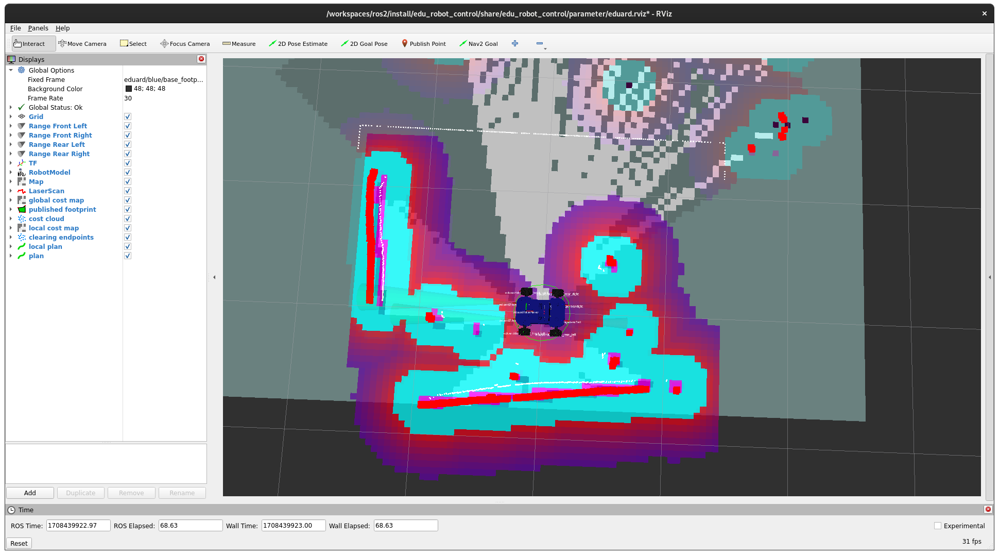

# SLAM and Nav2

In the following instructions, we will illustrate how to use a SLAM and navigation with our EduArt robots. The instructions are suitable for all our robots that are operated with edu_robot. In the following example, the robot Eduard is used.



## Installing of ROS SLAM Toolbox

The SLAM is provided as a Docker image. If the robot was installed after our [First Time Setup](../setup/overview.md), the SLAM can be installed and started with the following commands.

> **Note**: It is assumed that an SSH connection to the robot exists and that the robot has an Internet connection.

First clone **edu_docker** if not already downloaded on your robot:

```bash
cd ~
git clone --branch main https://github.com/EduArt-Robotik/edu_docker.git
```

Launch the SLAM using following command:

```bash
cd ~/edu_docker/slam_tool_box
docker compose up
```

Since the robot namespace was set by an environment variable, all topics and parameter are adapted accordingly.

## Installing of ROS Navigation

All packages are provided as Docker images. This makes installation very easy. The only requirement is a functioning Docker runtime. This should already be present on the robot if it has been installed according to the [instructions](../setup/overview.md). For performance reasons, it is possible that nav2 cannot be executed on the robot. This is the case with the Eduard-IoT. Here, nav2 must be run on a more powerful machine. Docker can also be used there, or you can just start our launch files with an existing ROS2 installation. Both methods are documented below.

### Using Docker Image

> **Note**: It is assumed that an SSH connection to the robot exists and that the robot has an Internet connection.

First clone **edu_docker** if not already downloaded on your robot:

```bash
cd ~ # or choose a folder you like
git clone --branch main https://github.com/EduArt-Robotik/edu_docker.git
```

Launch nav2 using following command:

```bash
cd ~/edu_docker/nav2 # adapt according the chosen folder above.
docker compose up
```

> **Note**: adapt the edu robot namespace "eduard" to the one used by your robot.

If you launching the docker image not on the robot, please be aware that the edu robot namespace muss fit to the robot. It can be set by putting the environment variable **EDU_ROBOT_NAMESPACE** in front of the command:

```bash
EDU_ROBOT_NAMESPACE=eduard docker compose up
```

### Using Launch File only

First make sure all needed ros2 package are installed:

* navigation2

After you can use the provided launch and parameter files from the package [edu_docker](https://github.com/EduArt-Robotik/edu_docker). The files are located in the folder **nav2/launch_content**.

Navigate into this folder and execute:

```bash
EDU_ROBOT_NAMESPACE=eduard ros2 launch navigation.launch.py
```

> **Note**: adapt the edu robot namespace "eduard" to the one used by your robot.

## Controlling and Visualizing Map and Navigation

An Rviz configuration is provided for controlling the navigation. This can be found in the [edu_robot_control](https://github.com/EduArt-Robotik/edu_robot_control) package

### Native ROS2 Installation

If ROS is natively installed the "edu_robot_control" package can be installed into an ROS workspace. As first step clone the package into the workspace by:

```bash
git clone https://github.com/EduArt-Robotik/edu_robot_control.git
```

Please make sure the package will be cloned into the "src" folder in the workspace. If no knowledge about ROS is present please see [docs.ros.org](https://docs.ros.org/en/galactic/Tutorials/Beginner-Client-Libraries/Creating-A-Workspace/Creating-A-Workspace.html) for further information. 

After the package was cloned it needs to be installed. First leave the "src" folder:

```bash
cd ..
```

Then build it by:

```bash
colcon build --packages-select edu_robot_control --symlink-install
```

### Launching RViz

The edu robot namespace can be set by using an environment variable. Either set it via the system or define it in front of the ros command:

```bash
EDU_ROBOT_NAMESPACE=eduard/red ros2 launch edu_robot_control eduard_monitor_nav2.launch.py
```

After RViz is launched the costmap should be displayed after a short while. Now a goal can be set by using the **2D Goal Pose** tool in RViz. A green path should be displayed if the goal is reachable. The robot will follow the path when it is switched into the mode **autonomous**. This can be done by pressing the **L2** button on the PS5 controller. The robot indicates this mode by flashing white LEDs.
