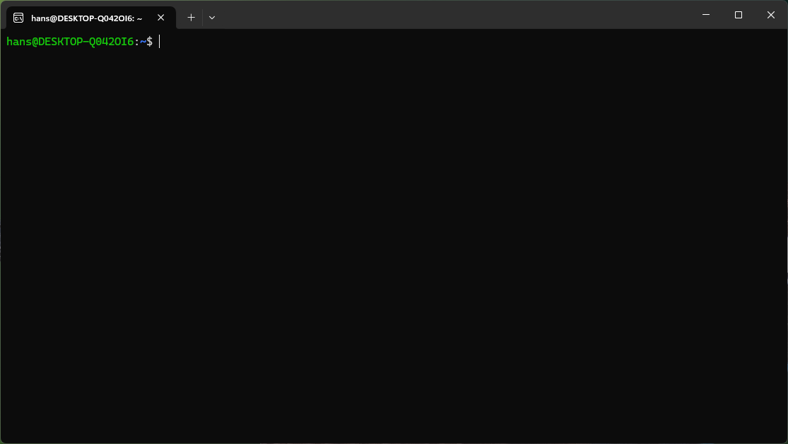

# WSL2 on Windows 11

For a connection with an EduArt robot via ROS2, WSL2 on Windows 11 is a possibility. Once set up, the user can use the software provided for Linux almost 1 to 1.

Setting up WSL2 and ROS2 is not complicated, but there are a few requirements that may violate IT security guidelines. Please clarify this beforehand. The following steps are necessary:
* Administrator privileges for installation and setup.
* WSL2's network mode must be allowed to be set to mirrored.
* The firewall for Hyper V must be deactivated. (possibly this can only be opened for certain ports, this still needs to be checked)

## Installing WSL2

Open a shell with administrator privileges and type in:

```bash
wsl --install Ubuntu-24.04
```

This command installs WSL2 and Ubuntu 24.04 distribution. If the installation was successful it should look like that
```bash
Windows Subsystem für Linux-Distributionen:
Ubuntu-24.04 (Standard)
```

when you type in:
```bash
wsl --list
```

### Optional! Setting Ubuntu 24.04 as default if wanted

>**NOTE:** If Ubuntu 24.04 is not your standard WSL distribution, you can set it to standard by following command:
```bash
wsl --set-default Ubuntu-24.04
```

Otherwise you have to use the argument **-d Ubuntu-24.04** every time you want to open a WSL shell!

```bash
wsl -d Ubuntu-24.04
```

### Configure Network for WSL2

To communicate with ROS2 nodes running on other network devices, it is necessary to mirror the network interface. This is set via the .wslconfig configuration file. Please open a power shell and enter the following:

```bash
cd ~
notepad.exe .wslconfig
```

The notpad opens. Please add to this file following content:

```bash
[wsl2]
networkingMode=mirrored 
firewall=false
```

Save and close the notpad.

### Disable Firewall for WSL2

At the moment we haven't discovered specific firewall rules for ROS2. But it is necessary to allow incoming traffic to be able to discover all ROS2 topics and services. For a easy setup we decided to disable the firewall. If you don't want to do this, please open the needed ports described [here](https://docs.ros.org/en/galactic/Concepts/About-Domain-ID.html).

To disable the firewall please open a Power Shell with administrator privileges and type in:
```bash
Set-NetFirewallHyperVVMSetting -Name '{40E0AC32-46A5-438A-A0B2-2B479E8F2E90}' -DefaultInboundAction Allow
Set-NetFirewallHyperVVMSetting -Name '{40E0AC32-46A5-438A-A0B2-2B479E8F2E90}' -DefaultOutboundAction Allow
```

>**Note** if you want to enable it again use the commands again but replace 'Allow' with 'Block'.

## Starting Up Ubuntu 24.04 using WSL2

Press the Windows key on your keyboard, type in **wsl** and press enter. WSL will start up and open an Ubuntu 24.04 shell. Please note that you have to enter a user name and password when starting first time.

The WSL2 shell looks like:


### Installing ROS2

Now ROS2 could be installed. We followed this [instructions](https://docs.ros.org/en/jazzy/Installation/Ubuntu-Install-Debs.html), but summarized it below:

* set local 
```bash
locale  # check for UTF-8

sudo apt update && sudo apt install locales
sudo locale-gen en_US en_US.UTF-8
sudo update-locale LC_ALL=en_US.UTF-8 LANG=en_US.UTF-8
export LANG=en_US.UTF-8

locale  # verify settings
```

* enable required repositories
```bash
sudo apt install software-properties-common
sudo add-apt-repository universe

sudo apt update && sudo apt install curl -y
sudo curl -sSL https://raw.githubusercontent.com/ros/rosdistro/master/ros.key -o /usr/share/keyrings/ros-archive-keyring.gpg

echo "deb [arch=$(dpkg --print-architecture) signed-by=/usr/share/keyrings/ros-archive-keyring.gpg] http://packages.ros.org/ros2/ubuntu $(. /etc/os-release && echo $UBUNTU_CODENAME) main" | sudo tee /etc/apt/sources.list.d/ros2.list > /dev/null
```

* upgrading system packages
```bash
sudo apt update
sudo apt upgrade
```

* installing development tools
```bash
sudo apt install ros-dev-tools
```

* installing ROS2 desktop
```bash
sudo apt install ros-jazzy-desktop ros-jazzy-rmw-cyclonedds-cpp
```

* setup environment (.bashrc file)
```bash
# open .bashrc file
nano ~/.bashrc
```

and add following lines to the bottom of the file:
```bash
# ROS2
export RMW_IMPLEMENTATION=rmw_cyclonedds_cpp

source /opt/ros/jazzy/setup.bash
```

Now ROS2 Jazzy is installed. Before it can be used it is necessary to close and open again the WSL shell.


### Using ROS2

At this point ROS2 Jazzy is ready to use. But somehow it seems to be necessary to start the ROS2 daemon before be able to work with the ROS2 cmd line tools.

The ROS2 daemon could be started by:

```bash
ros2 daemon start
```

### Troubleshooting

#### Rendering Problem

If you discover a low FPS rate combined with a high CPU usage, then it could be that the rendering is done by software only. To check if software-only rendering is used, please install the mesa utils:

```bash
sudo apt update
sudo apt install mesa-utils
```

After using the glxinfo tool to query the used render device:

```bash
glxinfo -B
```

The following like information is displayed:

```bash
name of display: :0
display: :0  screen: 0
direct rendering: Yes
Extended renderer info (GLX_MESA_query_renderer):
    Vendor: Microsoft Corporation (0xffffffff)
    Device: D3D12 (NVIDIA GeForce RTX 3080 Ti) (0xffffffff)
    Version: 25.0.7
    Accelerated: yes
    Video memory: 28423MB
    Unified memory: no
    Preferred profile: core (0x1)
    Max core profile version: 4.6
    Max compat profile version: 4.6
    Max GLES1 profile version: 1.1
    Max GLES[23] profile version: 3.1
Memory info (GL_ATI_meminfo):
    VBO free memory - total: 11302 MB, largest block: 11302 MB
    VBO free aux. memory - total: 0 MB, largest block: 0 MB
    Texture free memory - total: 11302 MB, largest block: 11302 MB
    Texture free aux. memory - total: 0 MB, largest block: 0 MB
    Renderbuffer free memory - total: 11302 MB, largest block: 11302 MB
    Renderbuffer free aux. memory - total: 0 MB, largest block: 0 MB
Memory info (GL_NVX_gpu_memory_info):
    Dedicated video memory: 12086 MB
    Total available memory: 28423 MB
    Currently available dedicated video memory: 11302 MB
OpenGL vendor string: Microsoft Corporation
OpenGL renderer string: D3D12 (NVIDIA GeForce RTX 3080 Ti)
OpenGL core profile version string: 4.6 (Core Profile) Mesa 25.0.7-0ubuntu0.24.04.1
OpenGL core profile shading language version string: 4.60
OpenGL core profile context flags: (none)
OpenGL core profile profile mask: core profile

OpenGL version string: 4.6 (Compatibility Profile) Mesa 25.0.7-0ubuntu0.24.04.1
OpenGL shading language version string: 4.60
OpenGL context flags: (none)
OpenGL profile mask: compatibility profile

OpenGL ES profile version string: OpenGL ES 3.1 Mesa 25.0.7-0ubuntu0.24.04.1
OpenGL ES profile shading language version string: OpenGL ES GLSL ES 3.10
```

In this case the GPU (RTX 3080 TI) is in use. It can be checked at the device entry. Also in the OpenGL rendering string. If you discover the **llvmpipe** than the software rendering is used. You can force the system to use the GPU by setting the following environment variable:

```bash
export GALLIUM_DRIVER=d3d12
```

in your bashrc.
