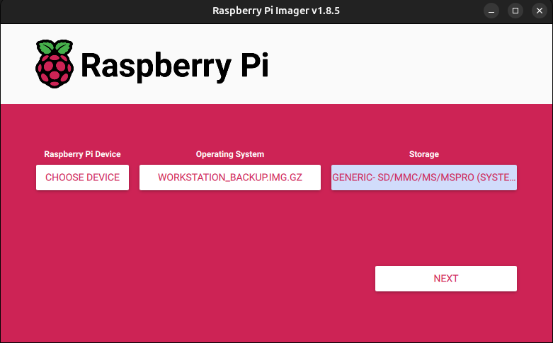

# How to create and flash Images to SD Cards
This guide explains, how to create an image of a existing SD card as a backup or for distribution and also, how to flash this or other images to a new card.

## Creating an Image of a existing SD Card
If you want to backup a SD Card of a Raspberry Pi for example, you can create an image that you can flash onto another SD card later.
This guide uses a Ubuntu-System to perform the backup.
A guide on how to do this on Windows might be added later.

1. Insert it into a adapter and plug it into your computer
2. Get the name of the device, for example with `sudo dmesg -w`. 
   Look for something like `sdb: sdb1 sdb2`. 
   This means that the name of the whole card is `sdb`.

>The following sections will use `sdb` as a example.
Make sure to replace it with the name of your device!

Now there are two options to continue
### Option 1 - Copy everything, including empty space
Pro: Makes sure that it is a 1:1 copy <br>
Con: No smaller SD card (or maybe even another type) can be used, takes longer to flash
1. Command to copy everything and compress it: <br>
`sudo dd if=/dev/sdb bs=4M | gzip > backup.img.gz`

### Option 2 - Copy only the used sections (recommended)
Pro: The compressed image is slightly smaller, the image can be flashed on smaller SD cards than the original one, much shorter flashing time <br>
Con: A bit more work when creating the backup 
1. Install *gparted*: `sudo apt install gparted`
2. Open *gparted* and shrink the partition to the smallest possible size or slightly larger
3. Apply changes in *gparted* with the green check-mark.
4. Still in *gparted*: Select the most right partition, right click it, select "Information" and look for "Last sector". Alternatively use `sudo fdisk -l /dev/sdb`. 
> Be careful to not accidentally select the "Sectors" of this partition instead of "End" of the partition!
5. In a terminal, copy and compress the used sectors with this command: <br>
  `sudo dd if=/dev/sdb count=<lastsector> status=progress | gzip > backup.img.gz` <br>
  Example: `sudo dd if=/dev/sdb count=35866623 status=progress | gzip > backup.img.gz`

## Flashing SD Card
The following shows two ways in which an image (whether self-created or downloaded) can be flashed to an SD card.

### RPi Imager (recommended)
In previous guides we used [`dd`](#using-dd) to flash the image onto the SD card.
However, to provide the same workflow for Windows and Linux, we now recommend to use the Pi Imager Software instead of `dd`.
It provides a GUI and therefore leaves less room for errors.
The software extracts the compressed image directly and supports archives like `.gz` or `.zip` on both Windows and Linux.

1. [Download](https://www.raspberrypi.com/software/) and install RPi Imager
2. Start the RPi Imager
3. Click "Choose OS" and scroll down to "Use custom".
4. Select the compressed image (e.g. `.gz`) you want to flash on the SD card.
5. Click "Choose Storage" and select the Device you want to flash. <br>
Your Settings now should look like this:

6. After pressing next, do NOT apply OS customisation settings (select "NO"). Afterwards, confirm that you want to flash the SD card.

The flashing process might take a couple of minutes. If you've created the image yourself and choose [Option 1](#option-1---copy-everything-including-empty-space), make sure the SD card you try to flash your image on is as big or bigger than the original card! If the flash process fails at ~98%, the size of the card was probably to small.

|     | Resizing after Flashing <br> Operating Systems (OS) for the RaspberryPi automatically extend their partition at the first boot to fill all free space on the SD Card. Normal desktop OS (like used for the IOT2050) don't do that so the user needs to resize the partition after flashing it on the SD-Card! For this, either boot into the system and do it from the inside or use *gparted* or *windows partition manager* to extend the partitions of the card.|
|-----------------------------------------------------------------------|--------------------|


### Using `dd`
This method is aimed at more experienced users and is only available on Linux.

First, find out the SD card device name on your Linux system. Connect the SD card by using an card reader. After the SD card is connected execute following command:

```bash
sudo dmesg
```

This prints the kernel messages on the terminal. Only the few latest are important. It should look like following:

```bash
[24180.935724] sd 3:0:0:4: [sdg] 124735488 512-byte logical blocks: (63.9 GB/59.5 GiB)
[24180.974016]  sdg: sdg1
```

In this case, the device name is **sdg**. So we will use this to flash the image. Execute the following command to unzip the downloaded image and flash it to the SD card:

```bash
unzip -p IOT2050_Example_Image_V1.3.1.zip | sudo dd of=/dev/<device name like sdg> bs=4M status=progress
```
> Note: replace the device name with the name of your SD card. 

After the process is finished it is good practice to synchronize the write-cache before removing the SD card.

```bash
sync
```