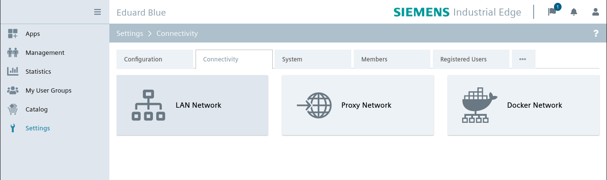
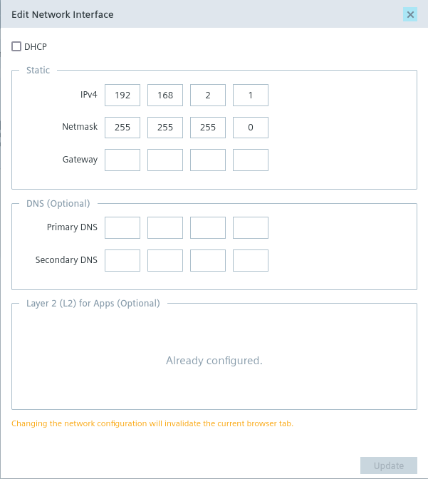
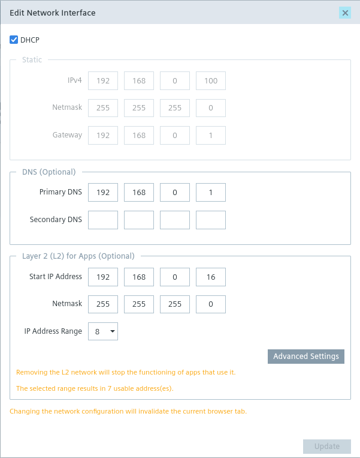

# SIEMENS Industrial Edge App

> **Note**: It is assumed that an Industrial Edge infrastructure already exists. This section describes how to build and install the control software for the Eduard robot. These instructions have been written for an IPC127e, but should also be valid for other machines.

## Configure IED for Eduard Control Application

The Eduard Control Application requires some network configurations to communicate with the hardware and to make the ROS topic and services accessible from outside the robot.

Login into the edge device. Navigate to the **Settings** and select **Connectivity**.

Open die **LAN-Network** settings dialog and start to configure the interface **eno1**. Configure according to the following image:

Next configure the interface **eno2** according to the following image:

Usually the interface **eno2** is connected to a Wifi access point with a pre-configured DHCP server from EduArt Robotik. If this is not the case, you must configure this interface yourself. Please note the network access layer of level 2. This is required so that the ROS topic and services are accessible from outside the robot. In fact, each Edge app gets its own IP address on this interface.

Next configure the interface **eno3**. This interface is reserved for maintenances or other usage. Please configure like you want.

## Building Industrial Edge Application

