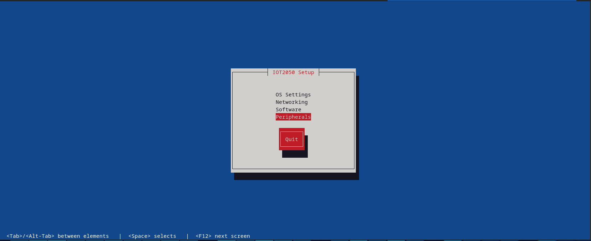
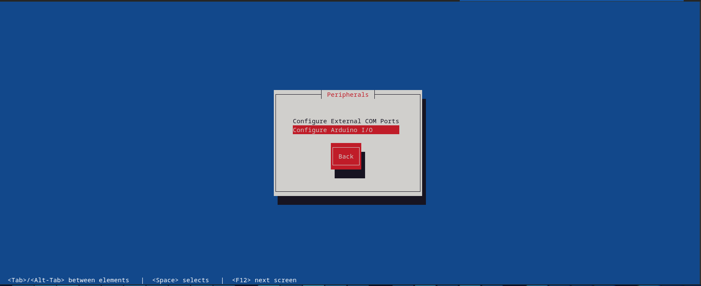
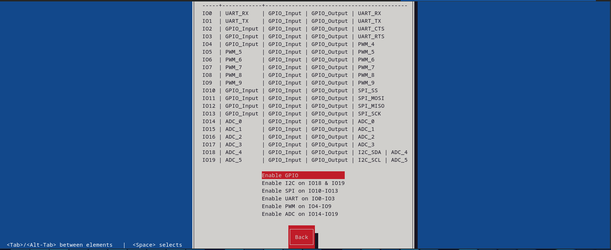

# GPIO on Iot2050

## Setup

GPIOs are available on the Iot2050. These are routed to the outside via a breakout board. To be able to use these, they must be configured using the **iot2050setup** tool. To do so, please execute following command on the robot:

```bash
sudo iot2050setup
```

It will open following screen. 



Please select **Peripherals** and press enter. It opens the **Peripherals** setup menu.



Please select **Configure Arduino I/O**. Now the current GPIO configuration of the Iot2050 is listed.



This tables show the current configuration. The left column shows the name of the GPIO pin. One column right it shows the current configuration of the GPIO pin. The next three columns show the possible configurations:

* **GPIO_Input** means the pin could be an input,
* **GPIO Output** means the pin could be an output and
* the last column shows the special functionality of the GPIO pin like PWM

Below we show how to setup an GPIO pin to be an input, output or an PWM output. At the moment the pin functionality is limited to these three.

### Input and Output


### PWM Output
