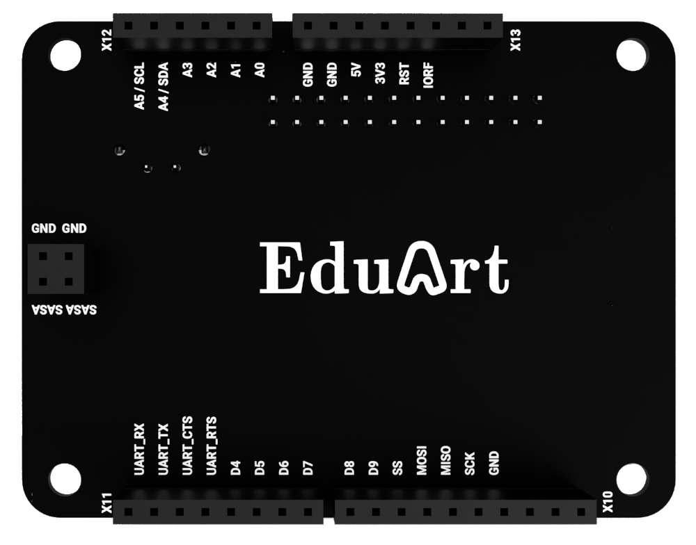
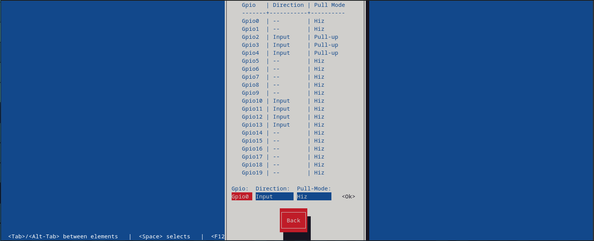
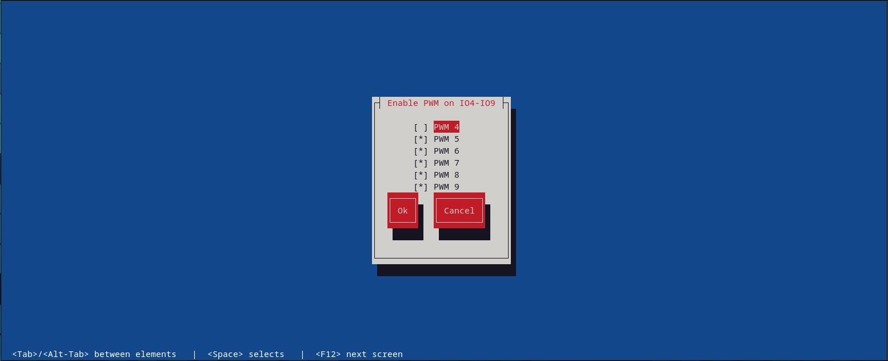

# GPIO on Iot2050



## Setup

GPIOs are available on the Iot2050. These are routed to the outside via a breakout board. To be able to use these, they must be configured using the **iot2050setup** tool. To do so, please execute following command on the robot:

```bash
sudo iot2050setup
```

It will open following screen. 


Please select **Peripherals** and press enter. It opens the **Peripherals** setup menu.


Please select **Configure Arduino I/O**. Now the current GPIO configuration of the Iot2050 is listed.


This tables show the current configuration. The left column shows the name of the GPIO pin (IOx corresponds to Dx on the board). One column right it shows the current configuration of the GPIO pin. The next three columns show the possible configurations:

* **GPIO_Input** means the pin could be an input,
* **GPIO Output** means the pin could be an output and
* the last column shows the special functionality of the GPIO pin like PWM

Below we show how to setup an GPIO pin to be an input, output or an PWM output. At the moment the pin functionality is limited to these three.

### Input and Output

For configuring an digital input or output, please select **Enable GPIO**. Following screen shows up:



All GPIOs are listed on top. Using the bottom line a GPIO pin could be configured. With the **Gpio** input filed a GPIO pin can be selected. The **Direction** field allows to configure the GPIO pin as **Input** or **Output**. The last field the **Pull-Mode** allows to enable an resistor. Following modes are exist:

* Hiz, no resistor activated. Input is floating.
* Pull-Up, resistor to V+ is activated.
* Pull-Down, resistor to GND is activated.

>**Note:** an activated resistor makes no sense, when GPIO pin is configured as **Output**!

Select according your needs and confirm it by pressed the **OK** button on the right. The new configuration should be shown on the table above.

### PWM Output

For configuring an PWM output, please select **Enable PWM on IO4-IO9**. Following screen shows up:



By pressing the space bar a PWM output can be activated or deactivated. Confirm your choice by pressing **OK**.

### Configuring EduArt control software for controlling GPIOs

EduArt provides a way to address the GPIOs via ROS2 Topics. The EduArt robots come with a preconfigured GPIO setting. This can be found under the path **edu_robot/docker/iot2050/launch_content**. Among other files, the files eduard.urdf and eduard_ros2_control_iot2050.yaml are contained there. These two files describe how ROS has to address the GPIOs. A plugin provided by EduArt then maps these commands to the hardware.

Following code snipped is from the file **eduard.urdf**. It defines which functionality is provided to ROS. These configuration needs to meet the configuration done by **iot2050setup** tool. The snipped shows the preconfigured GPIOs by EduArt. It comes with two GPIO groups, **x10** and **x11**. These groups reflects the connectors mounted on the GPIO board.

If you want to change the GPIO function following are applied:

* Input
  * The pin requires **din** in its name.
  * Only a **state_interface** needs to be defines. (Input will only be read)
  * In this case the **state_interface** requires the **pin** parameter.
* Output
  * The pin requires **dout** in its name.
  * A output needs to have a **command_interface** and a **state_interface** definition.
  * The **command_interface** requires the **pin** parameter.
  * The **state_interface** don't need a parameter at all in this case.
* PWM Output
  * The pin requires **pwm** in its name.
  * A PWM output needs to have a **command_interface** and a **state_interface** definition.
  * The **command_interface** requires the **pin** and **period_us** parameter.
  * The **state_interface** don't need a parameter at all in this case.  


```xml
  <!-- GPIO Iot2050-->
  <xacro:if value="${'iot2050' in '$(arg hardware)'}">
    <ros2_control name="eduard_iot2050_hardware" type='system'>
      <hardware>
        <plugin>eduart/robot/hardware/iot_shield/Ros2HardwareAdapter</plugin>     
      </hardware>
      <gpio name="x10">
        <command_interface name="pwm_8">
          <param name="period_us">1000</param>
          <param name="pin">8</param>
        </command_interface>
        <state_interface name="pwm_8"/>

        <command_interface name="pwm_9">
          <param name="period_us">1000</param>
          <param name="pin">9</param>
        </command_interface>
        <state_interface name="pwm_9"/>
      </gpio>
      <gpio name="x11">
        <state_interface name="din_2">
          <param name="pin">2</param>
        </state_interface>

        <state_interface name="din_3">
          <param name="pin">3</param>
        </state_interface>

        <state_interface name="din_4">
          <param name="pin">4</param>
        </state_interface>

        <command_interface name="pwm_5">
          <param name="period_us">1000</param>
          <param name="pin">5</param>
        </command_interface>
        <state_interface name="pwm_5"/>

        <command_interface name="pwm_6">
          <param name="period_us">1000</param>
          <param name="pin">6</param>
        </command_interface>
        <state_interface name="pwm_6"/>

        <command_interface name="pwm_7">
          <param name="period_us">1000</param>
          <param name="pin">7</param>
        </command_interface>
        <state_interface name="pwm_7"/>
      </gpio>
```

ROS is using **ros_control** to drive the in- and outputs. This software needs a configuration that tells it what interface (GPIOs) does exist. These is done by the file **eduard_ros2_control_iot2050.yaml**. If you did changes on **eduard.urdf** you need to take care that the definitions are also present in the yaml file.

```yaml
/**:
  ros__parameters:
    type: gpio_controllers/GpioCommandController
    gpios:
      - x10
      - x11
    command_interfaces:
      x10:
        - interfaces:
          - pwm_8
          - pwm_9
      x11:
        - interfaces:
          - pwm_5
          - pwm_6
          - pwm_7


    state_interfaces:
      x10:
        - interfaces:
          - pwm_8
          - pwm_9
      x11:
        - interfaces:
          - din_2
          - din_3
          - din_4
          - pwm_5
          - pwm_6
          - pwm_7
```

