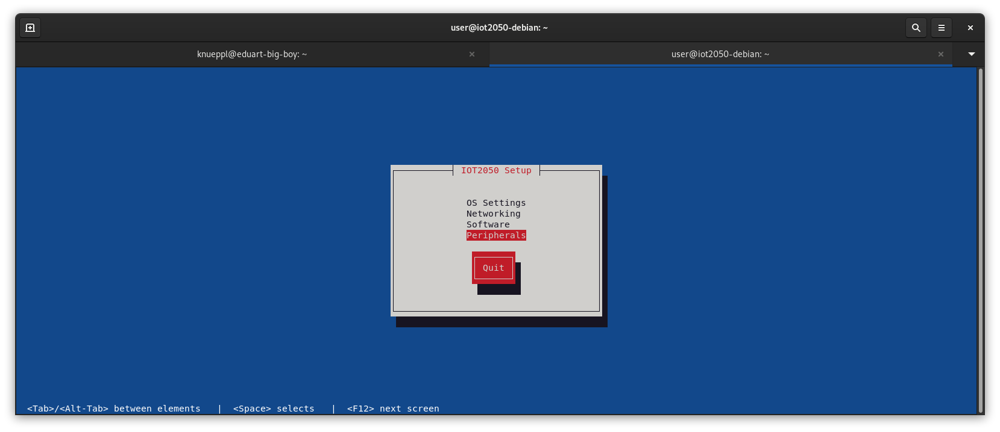
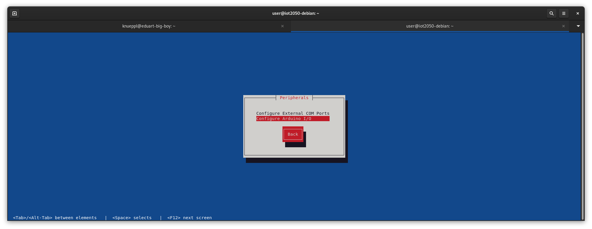
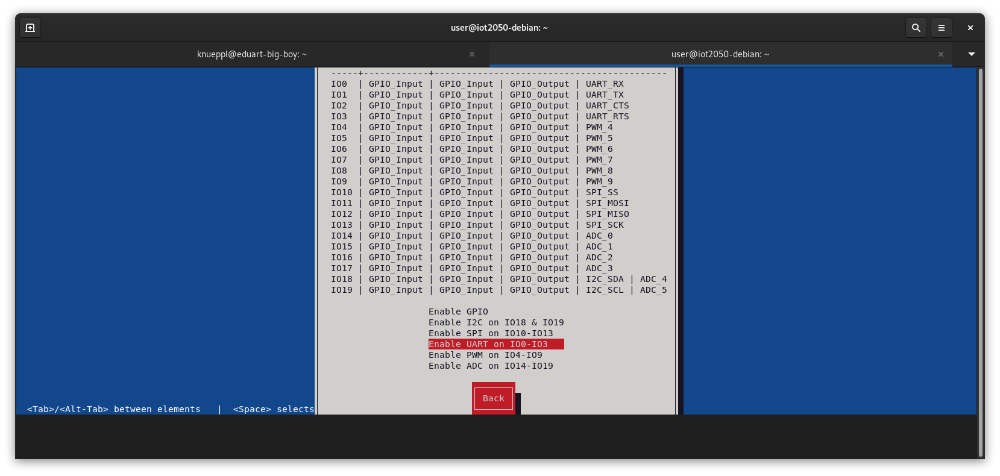
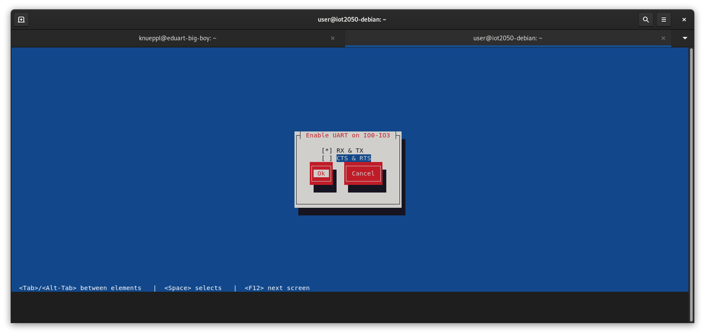

# First Time Setup of IoT2050

## SD Card Image

It is considered that the official ["Example Image V1.3.1"](https://support.industry.siemens.com/cs/document/109741799/downloads-f%C3%BCr-simatic-iot20x0?dti=0&lc=de-DE) provided by Siemens will be used for the IoT2050. If this is not the case there is no guarantee that the instructions below will work as expected.

### Flashing SD Card on Linux

> **Note**: sudo privileges are required.

On Linux the SD card can be flashed using two commands after the ["Example Image V1.3.1"](https://support.industry.siemens.com/cs/document/109741799/downloads-f%C3%BCr-simatic-iot20x0?dti=0&lc=de-DE) was downloaded.

First estimate the SD card device name on your Linux system. Connect the SD card by using an card reader. After the SD card is connected execute following command:

```bash
sudo dmesg
```

This prints the kernel messages on the terminal. Only the few latest are important. It should look like following:

```bash
[24180.935724] sd 3:0:0:4: [sdg] 124735488 512-byte logical blocks: (63.9 GB/59.5 GiB)
[24180.974016]  sdg: sdg1
```

In this case, the device name is **sdg**. So we will use this to flash the image. Execute

```bash
unzip -p IOT2050_Example_Image_V1.3.1.zip | sudo dd of=/dev/<device name like sdg> bs=4M status=progress
sync
```

to unzip the downloaded image and flash it to the SD card. Note: replace the device name according your estimated one. Thats it! Now put the SD card into the IOT2050.

### Flashing SD Card on Windows

> **Note**: will be updated soon

### Booting Up First Time

After the SD card was flashed successfully connect a keyboard and monitor to the IoT2050 device. Power it on. The **STAT** LED will start to flash in orange when the IoT2050 is power up the first time. This will take some time (~ 1 minute). When the LED stops blinking it should then light up in green. At this moment a login prompt is displayed on the monitor:

```bash
Debian GNU/Linux 11 iot2050-debian tty1

iot2050-debian login: 
```

Login with user name 'root' and password 'root'. During the login you have to set a new password for the root user. Now connect your robot with the internet using the LAN **P2** connector. After we need to install the SSH server by the command:

```bash
apt update
apt install openssh-server
```

After we recommend to create a user to avoid working with the root user. In this case the user 'user' is created. Execute following command:

```bash
adduser user
adduser user sudo
```

The questions regarding phone, etc can be empty. Do like you want. Now a connection to the robot can be established using SSH. That means no keyboard and monitor is required anymore.

## Configure Devices on IoT2050

> **Note**: All commands below are executed on the Robot. Either connect a monitor and keyboard to the IoT2050 or connect via SSH.

For the SSH connection first you have to estimate the robot's IP address. Usually this cloud be found on your routers web interface. When you estimated the IP address you can connect by:

```bash
ssh user@<robot ip address>
```

### UART

The UART is required to communicate with the IoT Shield. Therefor it has to be enabled and set up. This could be done using the iot2050 setup tool. Open the tool by:

```bash
sudo iot2050setup
```

First select 'Peripherals' 
Then select 'Configure Arduino IO' 
After select 'Enable UART on...' 
And as last step configure the UART according following image 

### GPIO

## Install Required Software

> **Note**: All commands below are executed on the Robot. Either connect a monitor and keyboard to the IoT2050 or connect via SSH.

For the SSH connection first you have to estimate the robot's IP address. Usually this cloud be found on your routers web interface. When you estimated the IP address you can connect by:

```bash
ssh user@<robot ip address>
```

### Docker Engine

Docker engine is used for executing our ROS software on the robot. Therefor the engine has to be installed. Please follow these [instructions](https://docs.docker.com/engine/install/debian/) including the [post install instructions](https://docs.docker.com/engine/install/linux-postinstall/).

> **Note:** We have also summarized the instructions here, but it could happen that they are not up to date:

1. Set up Docker's apt repository.

```bash
# Add Docker's official GPG key:
sudo apt-get update
sudo apt-get install ca-certificates curl gnupg
sudo install -m 0755 -d /etc/apt/keyrings
curl -fsSL https://download.docker.com/linux/debian/gpg | sudo gpg --dearmor -o /etc/apt/keyrings/docker.gpg
sudo chmod a+r /etc/apt/keyrings/docker.gpg

# Add the repository to Apt sources:
echo \
  "deb [arch="$(dpkg --print-architecture)" signed-by=/etc/apt/keyrings/docker.gpg] https://download.docker.com/linux/debian \
  "$(. /etc/os-release && echo "$VERSION_CODENAME")" stable" | \
  sudo tee /etc/apt/sources.list.d/docker.list > /dev/null
sudo apt-get update
```

2. Install the Docker packages.

```bash
sudo apt-get install docker-ce docker-ce-cli containerd.io docker-buildx-plugin docker-compose-plugin
```

3. Add your user to the docker group.

```bash
sudo usermod -aG docker $USER
```

4. Run the following command to activate the changes to groups:

```bash
newgrp docker
```

5. Verify that you can run docker commands without sudo:

```bash
docker run hello-world
```

### Git

Install git by following command:

```bash
sudo apt update
sudo apt install git
```

## Install ROS Control Software

### Prepare Environment

By default the used namespace for ROS topics, services and tf is 'eduard'. If multiple robots are connected to the same network, each robot must be given its own namespace in order to differentiate between the robots. In order to apply this namespace to all ROS nodes (control software) a environment variable needs to be set. The easiest way is defining it in the file '/etc/environment' by:

```bash
sudo nano /etc/environment
```

Now define the variable. Here in this example 'eduard/blue' was chosen. This namespace will respected by all EduArt's ROS nodes.

```bash
# EduArt
EDU_ROBOT_NAMESPACE=eduard/blue
```

**For nano beginners:** to leave nano press *Strg+x* followed by *y* followed by *Return*.

You have to log out and log in again for the setting to take effect.

```bash
sudo reboot
```


### Get Control Software and Launch it

First clone the Git repository by executing the command:

```bash
cd ~
git clone --branch main https://github.com/EduArt-Robotik/edu_robot.git
cd ~/edu_robot/docker/iot2050
```

In this folder a docker compose file is located. It is used to launch the basic control software including joy node and a joy interpreter. Launch the software by:

```bash
docker compose up
```

The software will be registered for auto start after the robot boots up. If you want to remove it from the autostart execute following command inside the same folder:

```bash
docker compose down
```

#### Modifying Parameter of Control Software

If you want to change the default parameter go to the folder 'launch_content' by:

```bash
cd ~/edu_robot/docker/iot2050/launch_content
```

Inside this folder two launch files and two parameter file are located. Usually it shouldn't be necessary to modify the launch files. So please let it untouched. The first parameter file ([eduard-iot2050.yaml](../../../docker/iot2050/launch_content/eduard-iot2050.yaml)) defines all parameter used to robot control software (edu_robot). Here for example the kinematic could be changed or the collision avoidance could be adapted.

The second parameter file ([remote_control.yaml](../../../docker/iot2050/launch_content/remote_control.yaml)) defines the user input interpretation. Here for example the joy stick button assignment could be changed or the maximum velocity at full throttle could be adapted.

To apply the new set parameter the software has to be relaunched. This can be done by:

```bash
cd ~/edu_robot/docker/iot2050
docker compose down
docker compose up
```

### Get Web Joy and Launch it

There is also a web server as an alternative to controlling the game with the gamepad. This makes it possible to control the robot with a browser.

First clone the repository 'edu_docker' which contains a docker compose file for starting up the web server:

```bash
cd ~
git clone --branch main https://github.com/EduArt-Robotik/edu_docker.git
```

After go inside the 'edu_web_joy' folder and launch the application by executing following command:

```bash
cd ~/edu_docker/edu_web_joy/iot2050
docker compose up
```

### Get RPLidar and Launch it

If your robot came with an RPLidar scanner than you can use our Docker image for controlling them. The ROS launch file was adapted in the way that the namespace is respected as in all EduArt's ROS nodes.

First clone the repository 'edu_docker' by the following command:

```bash
cd ~
git clone --branch main https://github.com/EduArt-Robotik/edu_docker.git
```

After go inside the 'rplidar' folder and launch the application by executing following command:

```bash
cd ~/edu_docker/rplidar
make install-udev-rules
docker compose up
```
