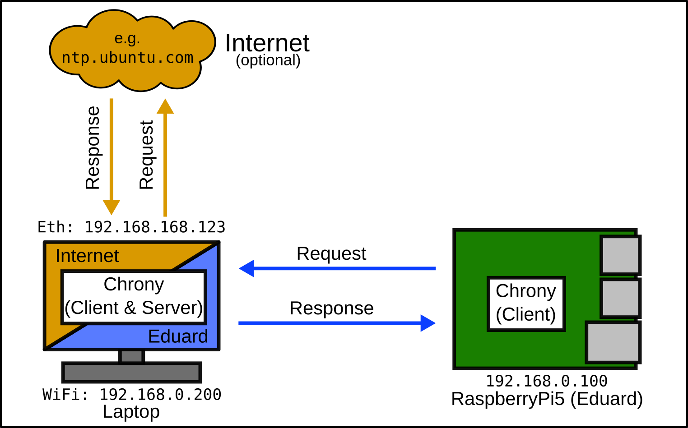

# Setup of a NTP Time Server

# Content
This guide describes why and how to setup a NTP time server on a Ubuntu system. It is mainly intended for the **Eduard Raspberry Pi5** edition.
- [Basic Concepts](#basic-concepts) <br>
  - [Why is Time important](#why-is-time-important) <br>
  - [Synchronization Concepts](#synchronization-concepts) <br>
  - [When can time become asynchronous?](#when-can-time-become-asynchronous) <br>
- [Solution: Providing your own Time](#solution-providing-your-own-time) <br>
  - [Timesyncd](#timesyncd) <br>
  - [Chrony](#chrony) <br>
    - [Enable Server Mode](#enable-server-mode)
    - [Change Time Source (Client Side)](#change-time-source-client-side)
    - [Troubleshooting](#troubleshooting)

# Basic Concepts
**Picture this:** <br>
You are using your laptop, which is (or previously was) connected to the internet, to connect to your Eduards Raspberry Pi. 
For this, you turn on the robot and connect to his internal WiFi. 
You decide you want to examine the robot data in RVIZ but upon opening you are getting warnings and error messages.
Something about asynchronous time...

This section explains briefly why it is important to have a synchronous time between systems, how synchronizing is commonly managed and why this sometimes can lead to issues. If you are only interested in the solution, skip to the next section.

## Why is Time important?
Timing is a important topic in the world of robotics. 
We constantly gather sensor data, process it and other things and then distribute it as messages on the local system or via the network to others. 
During this process, messages get marked with the current time. 
To keep the timing of these messages consistent it is necessary that all participants in a network share the same time. 
If clock of the robot, for example, lags a few seconds behind, ROS2 wouldn't know how to handle them with the data on another system.

## Synchronization Concepts
To keep the time of a system up to date there a mainly two concepts: 
Synchronizing with a reliable source and/or keeping track of the elapsed time by yourself with a real-time clock (RTC).
<!--- Explain NTP Basics (Port, ...)  -->
Usually these two methods are used in combination. 
A normal desktop PC usually requests the current time from a server on the internet in regular intervals. 
Between the requests, the the RTC keeps the time in sync. 
If the PC is powered down and disconnected from the power source, a small battery keeps the RTC running.

## When can time become asynchronous?
A robot might not have its own RTC (like Raspberry Pi 4 and earlier) or if it does (like a Raspberry Pi 5), it needs an [additional battery](https://www.raspberrypi.com/products/rtc-battery/) to keep it powered if the main power source is disconnected. So if the robot gets powered down, the current time gets saved but not updated. If its powered on again and not connected to the internet, it can't synchronize with a online source and therefore has a old system time. 

# Solution: Providing your own Time
Instead of relying on an online source to provide the current time, you can also use a source in your local network. For this you need to do two things. Setup a Server that can provide the current time and then configure your clients to use this self-hosted time server.

The following image shows the setup:
A laptop connects to the robots network (Eduard) and serves the current time. Clients, like the robot itself, can send NTP messages to the server to request the current time.
The server can update its local time via the internet or keep it up to date via its RTC.



The next two subsections describe the features and limitations of the time services `timesyncd` and `chrony`  and how they can be configured to fit our needs.

## timesyncd
Ubuntu 24.04 (and probably Debian) uses the **`timesyncd`** as a default service to get the current date and time via NTP (Network Time Protocol).
Unfortunately, `timesyncd` is not capable of acting as a server itself. We therefore need to switch to a different service called `chrony` (see next subsection). Nevertheless, here are some informations on how to configure and use `timesyncd`. 

The service can be configured by editing the file located here:
```bash
sudo nano /etc/systemd/timesyncd.conf
```

The default values (seem to be compiled into the service) use the `ntp.ubuntu.com` server, which can be seen when executing this command:
```bash
timedatectl timesync-status
```

## chrony
**`Chrony`** is a alternative to the default **`timesyncd`** service. It can be installed with this command:
```bash
sudo apt install chrony
```

The **configuration** of `Chrony` can be changed by editing the configuration file located here:
```bash
sudo nano /etc/chrony/chrony.conf
```

### Enable Server Mode
In the normal configuration, `Chrony` only fetches the time, just like `timesyncd`. However, by editing the configuration, `Chrony` can also act as a server for the local network. For this, add the following lines to the end of the config file:
```conf
# Use this machine to serve the local time to devices in your local network
allow 192.168.0.0/24
# Continue serving time if disconnected from internet
local stratum 10
```
The `allow` directive enables `Chrony` to serve the NTP requests, in this case on the `192.168.0.*` network. 
The second directive `local stratum` sets the "accuracy" of the time of this server, so the local machine. Stratum means "distance" to a real time source (like a atomic clock). Normally, if this machine doesn't have internet it would be unsynchronized (level 16). Therefor the clients wouldn't in turn choose the e.g. laptop as a viable time source. This directive sets the level of the local time of the laptop to a fixed 10 which means something like "this is a local fallback, not a true time authority". So the client would choose it as its time source if it doesn't have a higher level source available.

Restart the `Chrony` service:
```bash
sudo systemctl restart chrony
```


To check if `Chrony` is bound to the right interfaces:
```bash
sudo ss -ulpn | grep chronyd
```
This should return at least one entry and it should look like the following: 
(NTP uses UDP on port **123**)
```bash
UNCONN 0  0  0.0.0.0:123   0.0.0.0:*   users:(("chronyd",pid=33483,fd=7))
```

You can list the clients of the server with this command:
```bash
sudo chronyc clients
```
This should list all clients (beside the localhost). If it doesn't, check the [troubleshooting guides](#troubleshooting) on how to [setup your firewall](#edit-your-firewall).

### Change Time Source (Client side)
The list and priority of servers which should be used to get the current time is also specified in the same config file. To now access the locally created server, add its IP (e.g. `192.168.0.200`) to the config file:
```conf
server 192.168.0.200 iburst
#pool 2.debian.pool.ntp.org iburst
```
Place all existing sources in a comment.

Afterwards restart the service:
```bash
sudo systemctl restart chrony
```

The following command should now list all the sources (in this case only the local one):
```bash
sudo chronyc sources
```
The symbol at the start of every entry means the following:

| Symbol | Meaning                              |
| ------ | ------------------------------------ |
| ^      | Source is a server                   |
| *      | Currently selected source            |
| +      | Good candidate for a source          |
| -      | Reachable, but lesser quality source |
| ?      | Not reachable Source                 |

You should see the IP address of your server marked with the `^*`.

## Troubleshooting
If the connection between a local server and a local client doesn't work, here are some tips on how to troubleshoot the potential issue:

### Check with WireShark
A fully functioning NTP connection consists of two UDP packages. The client sends a request to the server IP:
```wireshark
2271	...    192.168.0.100	192.168.0.200	NTP	90	NTP Version 4, client
```
The server then needs to answer this request:
```wireshark
2272	...    192.168.0.200	192.168.0.100	NTP	90	NTP Version 4, server
```
If there is no answer from the server, there might be some issue with the firewall on the server side. Check if the rule is active that allows the packages on port 123 to pass trough!

### Edit your Firewall
>Note: Modifications to your firewall can compromise your systems security! Be careful about your doing.

In some circumstances the firewall might block incoming NTP requests. To fix this, create a rule for `ufw` ("uncomplicated firewall", a controller for the `iptables`) or directly for the `iptables`. It is recommended that you create an entry in the `iptables` since adding a rule to `ufw` turns the firewall on (it off by default) and this can lead to communication issues with other software due to blocked ports.

- Add an entry to `iptables` (recommended):
```bash
sudo iptables -A INPUT -p udp --dport 123 -s 192.168.0.0/24 -j ACCEPT
```

- Add a firewall rule to `ufw`:
```bash
sudo ufw allow from 192.168.0.0/24 to any port 123 proto udp comment 'Allow NTP requests from local network'
```
