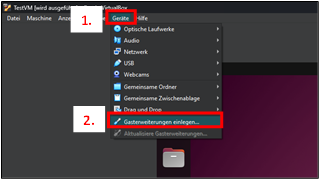
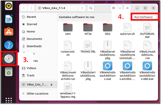
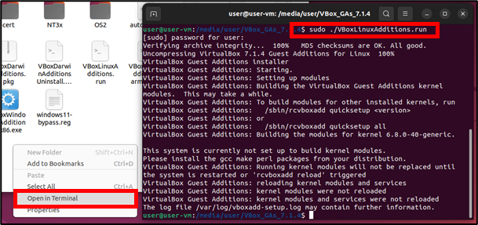

# Setup of a Virtual Machine

## Prerequisites
- Host OS: Windows 11
- Host-Architecture: amd64
- Software: Oracle Virtual Box (7.1.4) installed

# 1. Download of the VM OS 
Choose one of the Ubuntu Versions:
1. Ubuntu 22.04.5 - ROS2 Humble ([link](https://releases.ubuntu.com/jammy/))
2. Ubuntu 24.04.1 - ROS2 Jazzy ([link](https://ubuntu.com/download/desktop))

# 2. Create a VM
1. Open *Oracle Virtual Box*
2. Click *New*
3. Choose a name and select the `.iso`-file of Ubuntu 22 or 24
4. Check the box "skip unattended installation"
5. Increase the memory to ~8 GB
6. Increase number of cores to ~6
7. Increase disk size to ~30 GB
8. Click *Finish*

# 3. Adjust VM
1. Select your VM and click *Change*
2. Go to *System* -> *Processor* and activate *PAE/NX* 
3. Increase the GPU memory to 128 MB and activate 3D acceleration
4. Choose *Network Tunnel* and your network name/adapter, preferably one with an active internet connection
5. Finish with *Ok*

# 4. Start VM
Work yourself through the installer. Here is a rough overview:
1. Choose *Try or Install Ubuntu*
2. Ubuntu Installer
   1. Install Ubuntu
   2. Choose keyboard layout
   3. Select normal installation and activate *install third-party software...*
   4. Choose *Erase disk and install Ubuntu*
   5. Select a time zone
   6. Enter your preferred user details
3. Restart your VM
4. Setup after the first restart
   1. Skip *Ubuntu Pro*
   2. Choose *Don't send system info*
   3. Finish by pressing *Done*

# 5. Install Guest Additions
Guest additions are needed for e.g. fullscreen
1. Choose the *Devices* tab
2. Select *Insert Guest Additions* <br>

3. Now, a disk icon should've appeared on the dock in Ubuntu. Click it.
4. Click *Run Software* in the newly opened folder. <br>

5. If Step 4 didn't have any effect, open a terminal in this folder (by right clicking) and execute the script as a superuser: `sudo ./VBoxLinuxAdditions.run` <br>

6. After the installation, minimize and maximize the window of the VM. The resolution should now adjust automatically.

# 6. Update and setup Ubuntu
1. Open a terminal
2. Update the OS: `sudo apt update && sudo apt upgrade`
3. Install some useful packages
   - Network scanner: `sudo apt install nmap`
   - Resource overview: `sudo apt install htop`

# 7. Install ROS2
1. Installation <br>
  For **Ubuntu 22**: follow the guide for ROS2 Humble ([link](https://docs.ros.org/en/humble/Installation/Ubuntu-Install-Debs.html)) <br>
  For **Ubuntu 24**: follow the guide for ROS2 Jazzy ([link](https://docs.ros.org/en/jazzy/Installation/Ubuntu-Install-Debs.html))
2. Add the `setup.bash` to your `bashrc`
   - Open the file with *Nano*: `nano ~/.bashrc`
   - Add the following at the bottom of the file:
     - For Humble: `source /opt/ros/humble/setup.bash`
     - For Jazzy: `source /opt/ros/jazzy/setup.bash`
3. Close the terminal and open a new one. Test if the ros commands (e.g. `ros2 topic list`) work.

# 8. Install the Cyclone DDS Middleware
Since version 0.5.0 of *edu_robot*, EduArt changed to *Cyclone DDS* as its default middleware.
1. Install *Cyclone DDS*
   - For Humble ([link](https://docs.ros.org/en/humble/Installation/DDS-Implementations/Working-with-Eclipse-CycloneDDS.html)): `sudo apt install ros-humble-rmw-cyclonedds-cpp` 
   - For Jazzy ([link](https://docs.ros.org/en/jazzy/Installation/DDS-Implementations/Working-with-Eclipse-CycloneDDS.html)): `sudo apt install ros-jazzy-rmw-cyclonedds-cpp`
2. The environment variable `RMW_IMPLEMENTATION` controls, which middleware is active. It is recommended to set it via the `bashrc`:
   - Open the file with *Nano*: `nano ~/.bashrc`
   - Add the following at the bottom of the file: `export RMW_IMPLEMENTATION=rmw_cyclonedds_cpp`
3. Close the terminal and open a new one. Test if the environment variable is set correctly: `echo $RMW_IMPLEMENTATION`

# 9. Download and Build the EduArt packages
The following section shows how individual packages can be built in the VM.
1. Create a ROS2 workspace <br>
The can be chosen freely. Here is a example: `mkdir -p ~/ros2/src`
2. Change into the source directory: `cd ~/ros2/src`
3. Download the packages *edu_robot* ([link](https://github.com/EduArt-Robotik/edu_robot)) and *edu_robot_control* ([link](https://github.com/EduArt-Robotik/edu_robot_control)) from GitHub:
```bash
git clone https://github.com/EduArt-Robotik/edu_robot.git
git clone https://github.com/EduArt-Robotik/edu_robot_control.git
```
4. Install some dependencies
   - *diagnostic_updater* ([link](https://github.com/ros/diagnostics)):
     - For Humble: `sudo apt install ros-humble-diagnostic-updater`
     - For Jazzy: `sudo apt install ros-jazzy-diagnostic-updater`
   - *xacro* ([link](https://github.com/ros/xacro)):
     - For Humble: `sudo apt install ros-humble-xacro`
     - For Jazzy: `sudo apt install ros-jazzy-xacro`
5. Change into the root directory of the workspace: `cd ..`
6. Build the packages: `colcon build --symlink-install`
7. Add the workspace to your `bashrc` file
   - Open the file with *Nano*: `nano ~/.bashrc`
   - Add the following at the bottom of the file: `source ~/ros2/install/setup.bash`

# 10 Connect to the Robot
1. In your host system (Windows), change your network to the robot network
2. Check that you've selected the right network adapter for tunneling
3. Inside Ubuntu, turn your network on and off
4. Check your IP address: `ip a` <br>
If you are connected to the robot network, the IP should look something like this: `192.168.0.XXX`
5. Check the connection to the robot: `ping 192.168.0.100`
6. Check the ROS topics: `ros2 topic list`